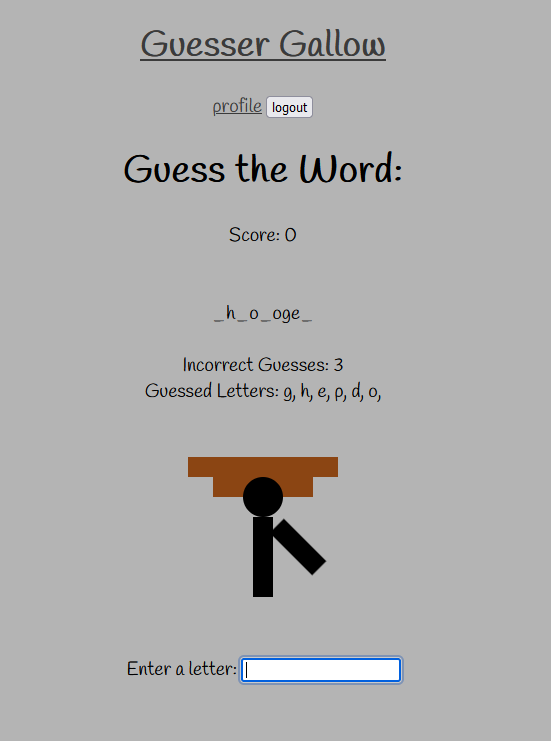

<h1 id='description'>Guesser Gallows </h1> Guesser Gallows is a lightweight, browser based game of hangman. When you start the game, you're given a word to guess which, if you guess any letter of wrong, will add another piece of our pal Guill to the gallows (don't worry he's wanted for multiple war crimes and tax evasion). If you guess right, you get started on another word and can keep going for a high score until, eventually, Guill joins the graveyard where you can view your score on a global leaderboard. <strong>Link:</strong> <a href="https://www.github.com/Shrcker/Guesser-Gallow">Github Link</a> <a href="https://guesser-gallows-04ed44eee1bd.herokuapp.com/">Deployed Site</a>  <h3>Table of Contents</h3><ol><li><a href="#description">Description</a></li><li><a href="#usage">Usage</a></li><li><a href="#credits">Credits</a></li><li><a href="#license">License</a></li><li><a href="#questions">Questions</a></li><li><a href="#contribute">How to Contribute</a></li></ol> <h2 id='usage'> Usage</h2>  Open the site and guess letters in a randomly chosen word until you get it right, or you mess up enough times to get booted to the graveyard! <h2 id='credits'> Credits</h2>  We'd like to credit OSU's Free Code Camp for facilitating the development of this project. <h2 id='license'> License</h2>  The MIT License <h2 id='questions'> Questions</h2>  Who created this project? <a href="https://www.github.com/Shrcker">Shrcker</a> <a href="https://www.github.com/Hammerc124">Hammerc124</a> <a href="https://www.github.com/Hammerc124">DakotaPatterson</a>  You can contact them through email: tanner.shirkey@gmail.com <h2 id='contribute'> How to Contribute</h2> Feel free to download and adjust the code base to suit your own needs. Just make sure you fork from this github and add different features before rehosting.
